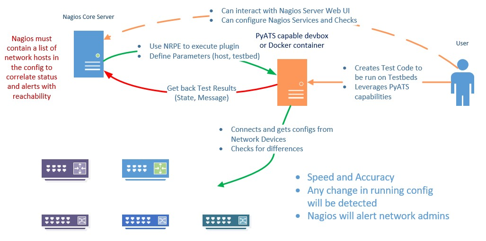

# check-config-changes
# Description
This Nagios plugin can get the config of a network device and check it for differences against a 'golden config image'.
The code uses Cisco PyATS to connect to the device and check for differences. The idea behind the plugin was to find a way to change the network state in a status variable (more about this in the Additional Notes section).

# CREDITS:
The python code to create golden config image and check for differences was created with Katerina Dardoufa (https://github.com/kdardoufa), Cisco PyATS team was consulted, thank you guys for your support!
The plugin structure is borrowed (although a little modified) from the check_cisco_ip_sla plugin by Maarten Hoogveld, maarten@hoogveld.org. I would have probably created something myself as it's not the first Nagios plugin I create but his work saved me some time, especially for arg parse.
# Prior to use
## Testbeds and configs directories
You need to have a 'testbeds' directory and a 'configs' directory under the one where you run the plugin (usually it's /usr/local/nagios/libexec). If any of them or both do not exist, the plugin will exit. Make sure the directories are there and readable, that the 'testbeds' dir contains the necessary testbeds and that the hostname you are interested in is correct and exists in the testbed. No exceptions are defined in the code to handle that.
## Golden Config - WARNING status
In order for the plugin to be used a golden config file is necessary for the host you want to check.
To do this simply run the plugin for that host and the relative testbed and it will give a WARNING status and a warning message the first time, but will query the device for the config and save it as a golden config.
You can then delete the current golden config to rearm the check.
## Create testbeds
If you need to create testbeds, you can check how to do that with various ways in the Cisco PyATS documentation here:
https://pubhub.devnetcloud.com/media/genie-docs/docs/cli/genie_create.html#cli-create-testbed
or if you have a Prime Infrastructure installation, use the code created here:
https://github.com/itheodoridis/itheodoridis-createtestbedsfromPI

In order to help with the understanding of the project, I have uploaded a sample testbed for you to modify and use in your infrastructure. It's in the testbeds directory. 

If you want you can modify this to play with the always on CSR-1k sandbox on the Devnet Sandbox environment.

Networking Sandboxes Overview - https://developer.cisco.com/docs/sandbox/#!networking/networking-overview
IOS-XE on CSR Latest Code - Always on Sandbox - https://devnetsandbox.cisco.com/RM/Diagram/Index/38ded1f0-16ce-43f2-8df5-43a40ebf752e?diagramType=Topology - Check instructions for related resources and other links. You need a CCO Login for that of course.

# Possible results
If the current config found to be the same as the golden config, an OK status is returned
If the current config found to be different than the golden config, a CRITICAL status is returned.
If the golden config is not present on disk, the current config is saved as the golden config and a WARNING status is returned. That status will surely return to OK when the plugin is run again as the golden config will be found and probably no differences will be found.
In any case, a status and a text message are returned.

# Installation
This was created using the standard PyATS docker container. For a full standard installation of PyATS you always have these two options:
- Use a python virtual environment where you install everything for PyATS using pip. I didn't do this here, and I am not recommending it, although the PyATS team does. You can do it if you want by following the instructions on the Getting started page here https://developer.cisco.com/docs/pyats/ , here https://developer.cisco.com/docs/pyats-getting-started/ and here https://pubhub.devnetcloud.com/media/pyats-getting-started/docs/install/installpyATS.htm then compare your own versions of packages the one I provide in requirements.txt. I would say just fully install PyATS and go for it, you should be fine.
- Install Docker if you don't have it on your system (for example ubuntu 18.04 instructions here https://www.digitalocean.com/community/tutorials/how-to-install-and-use-docker-on-ubuntu-18-04 by Brian Hogan) and then run PyATS using their instructions here https://pubhub.devnetcloud.com/media/pyats-getting-started/docs/install/installpyATS.html#using-docker (that's almost what I did and it will work)
- If you already know a thing or two about docker, docker images, dockerfile and docker-compose, you can copy the files from here https://github.com/CiscoTestAutomation/pyats-docker and edit your own dockerfile and run the container by this command. I have included a build directory where you can keep those and run from there. You don't need to do that but it feels nice to have some control over the environment. For example I added vim in my own environment inside the container, which you don't really need to run this plugin.

To install just clone this repository and use the script but remember to create the testbeds and configs directories and configure their access rights approprietly. Or simply copy the script contents in your own python scripts.
Remember that you need to have testbed files (*.yaml) in your testbeds directory. You must also know the hostname of the host you want to check before hand so make sure it is defined in your testbed.

If you want to use the container approach:
- Install Docker using the guide I provide as a link for ubuntu, or find your own for your linux system (don't forget to install docker-compose in that case, it's a separate package).
- Create an /opt/pyats directory in your docker host (where you installed Docker). 
- Create a cases directory and a build directory under /opt/pyats
- Copy the script in the cases directory.
- Copy the contents of this repo build directory (they are modified copies of the original files from the pyats docker github repo) under /opt/pyats/build
- Create a testbeds directory and a configs directory under /opt/pyats/cases. Be carefull with rights, although I am sure the container will not have any problems as it mounts files as root.
- Put your testbed in /opt/pyats/cases/testbeds . Use the provided testbed as an example or take a look at the documentation links I provided to make our own.
- go in /opt/pyats/build and run <code>docker-compose run --rm pyats</code> to build your own image. It will also start the container interactively - that's default behavior. Either run something first or just exit it. The container will be destroyed but the image will remain in your system.
- you can now run the plugin using this command line: <code>docker-compose -f config-check.yml run --rm pyats python3 /pyats/cases/check-config-changes.py -H nexus1 -t nxos.yaml</code> (or use your own defined hostnames in your own testbed file). That will start the container with the modified entry point that is loaded in the container at start instead of the original docker-entrypoint.sh that is copied in during the image creation process. Echo commands in the modified entrypoint.sh (cases-entrypoint.sh) have been commented out so as not to mess with plugin output for the Nagios Server, as it expects a status code and a message at least (perf data optionally, none here).
- If you run it for the first time, the result should look like <code>Warning - Golden Config did not exist. Created for : nexus1</code>
- For the subsequent times or in case there was already a golden config file, you should get: <code>OK - No changes in Running Config</code>
- to get the results to the Nagios Server either you need to install Nagios on the docker host, or install NRPE on the docker host and call the plugin remotely (that takes some config) or use another container for Nagios and build another nice container group with a nicely organized docker-compose (no way I am documenting that, it's possible through, take a look here: https://github.com/JasonRivers/Docker-Nagios )

# Running just the plugin
Running Nagios plugins inside a Nagios Core configuration requires some knowledge. I will not get into that here. However you can also run the plugin in command-line, like this:
<code>python3 check-config-changes.py -H hostname -t testbed</code>
where hostname is the test definining the name of your host in the testbed and testbed is the testbed filename (*.yaml) in the testbeds directory.

Again, this is just the Nagios plugin. How you decide to combine the plugin with Nagios Core server, PyATS and your devices, is none of my business. You can do an all in one installation with everything on the same box (Nagios, the plugin and PyATS) just be mindfull that PyATS needs a fairly current version of Python 3 to run. So for example it's ubuntu 18.04.x LTS at least, 16.04.x is not going to cut it.
You can keep a separate installation of Nagios in one system and install the plugin, PyATS and NRPE (Nagios Remote Plugin Executor) in another system (no docker). Or you can install the PyATS container with Docker anywhere and run the container with the plugin script as an argument. I am only providing the plugin. I will not delve into Nagios or Docker installation and configuration in this repo, it's not a blog post.

# Additional Notes
The idea behind the plugin was to find a way to change the network state in a status variable. When checking the state of an interface we check with SNMP whether it's operational state returns a proper value which we then map to OK, Warning, Critical etc. Why not do this with the whole network? This idea came to me when I first heard about PyATS. Checking for a running config was only an excuse, and it came to me when we were running upgrades and our running config dissappeared on some of the switches. A very scary bug. 
Eventually, if one creates test scritps for the network, these could end up with a set of values depending on where certain tests give a PASS result or not. That could be turned to a state variable for a whole network function like for example high availability routing for the network branches or the Enterprise Internet Access. Why not inform the appropriate teams about such an issue, using the Nagios scalable architecture. PyATS is just the tool to turn a network function or behavior into a state variable. I will write more about this in a future blog post. 

If you like PyATS, follow them everywhere (webex teams, Twitter, developer.cisco.com), they are a wonderfull team of gifted human beings.

If you have questions you can look me up on Twitter @mythryll. 

My blog is at http://www.mythryll.com/

This is not an example for proper PyATS usage. You can find plenty of information in the PyATS documentation and in Cisco Devnet Learning Paths as well, at https://developer.cisco.com/

